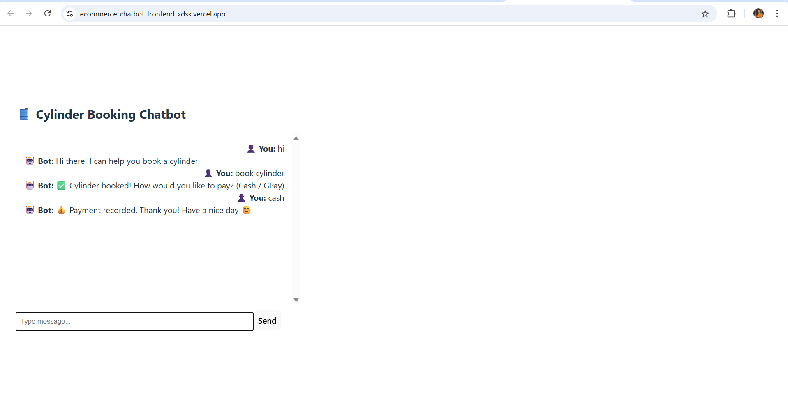

# 🤖 Ecommerce Chatbot – Cylinder Booking Assistant

A simple chatbot project built using React (frontend) and Flask (backend) to simulate cylinder booking conversations. Deployed on **Vercel** (frontend) and **Render** (backend).

---

## 🌐 Live Links

- 🔸 **Frontend:** [https://ecommerce-chatbot-frontend.vercel.app](https://ecommerce-chatbot-frontend.vercel.app)
- 🔸 **Backend:** [https://ecommerce-chatbot-backend-glj7.onrender.com](https://ecommerce-chatbot-backend-glj7.onrender.com)

---

## 🧠 Features

- React + Vite-based chatbot UI
- Flask REST API for message processing
- Axios for HTTP requests
- Basic styling + user-friendly layout
- CORS enabled for cross-origin requests
- Easy deployment on Vercel and Render

---

## 🖼️ Screenshot

### Chatbot UI


---

## 📁 Project Structure
/frontend → React + Vite frontend
/backend → Flask backend API


---

## 🚀 Local Setup

### ▶️ Backend (Flask)

```bash
cd backend
python -m venv venv
venv\Scripts\activate   # Windows
pip install -r requirements.txt
python app.py
 ```
 
 ### Frontend (React)
```
cd frontend
npm install
npm run dev
```

# 📝 How It Works
- User types a message into the chatbot.

- Axios sends a POST request to:

- Flask receives the message and returns a reply.

- React updates the UI to display bot response.

# 🛠️ Tech Stack
-**Frontend:** React, Vite, Axios

-**Backend:** Python, Flask, Flask-CORS

-**Deployment:** Vercel (frontend), Render (backend)

# 📚 License

- MIT